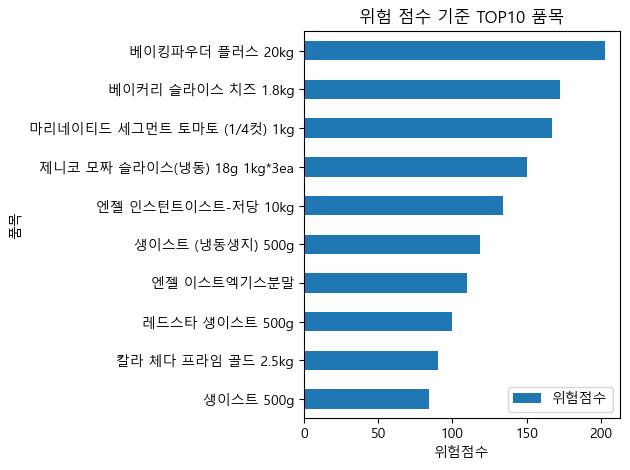
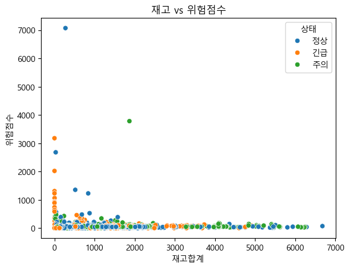
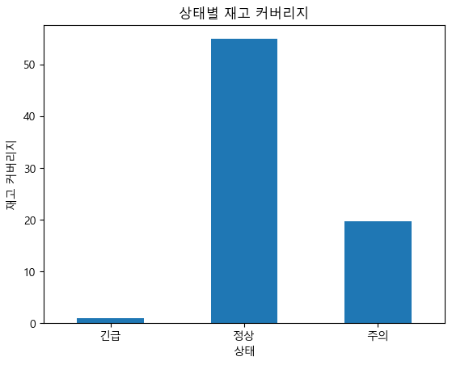
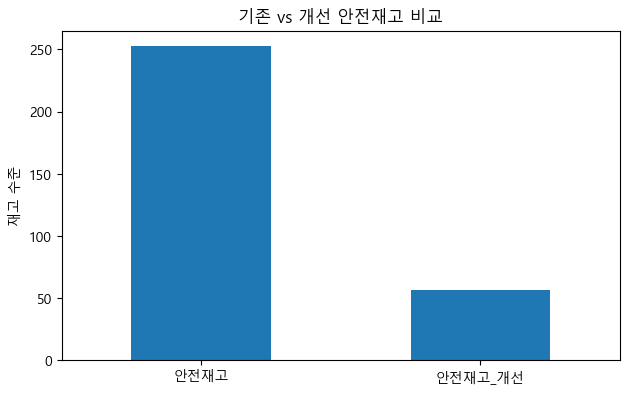

# 📦 실무 재고관리 데이터 분석 프로젝트  
### “재고 부족을 보는 것이 아니라, 먼저 대응해야 할 품목을 찾는 문제”

---

## 🧩 문제 정의 (Why)

실무에서 재고 관리는 단순히 “재고가 부족한가?”를 보는 문제가 아니었습니다.  

> ❗ **“수백 개 품목 중에서, 지금 당장 대응해야 할 품목은 무엇인가?”**

하지만 기존 방식에는 명확한 기준이 없었습니다.

- 재고 수량만으로는 실제 위험 판단이 어려움  
- 소비 속도가 반영되지 않아 위험 품목 식별 불가  
- 보충 우선순위 기준이 없어 담당자 경험에 의존  
- 반복적인 수작업 확인으로 업무 비효율 발생  

👉 결국,  
**재고 상태를 ‘판단’이 아니라 ‘정량화’할 필요가 있었습니다.**

---

## 🎯 해결 접근 (How)

이 문제를 해결하기 위해  
재고를 단순 수치가 아닌 **“위험도”로 재정의**했습니다.

### 핵심 접근 방식

1. 재고 + 소비량 결합  
2. 안전재고 기준 설계  
3. 상태 분류 (긴급 / 주의 / 정상)  
4. 위험점수 모델링  
5. 보충 우선순위 도출  

👉 목표는 단순 분석이 아니라  
**“실무에서 바로 사용할 수 있는 판단 기준”을 만드는 것**이었습니다.

---

## 📊 핵심 결과 (What)

### 🔴 1. 위험 점수 기준 TOP10 품목  


👉 “어떤 품목을 먼저 보충해야 하는가”를 명확하게 도출  

---

### 🔵 2. 재고 vs 위험점수 관계  


👉 동일한 재고 수준에서도 소비 패턴에 따라 위험도가 크게 달라짐  

👉 **재고 ≠ 위험**이라는 핵심 인사이트 확인  

---

### 🟡 3. 상태별 재고 커버리지  


👉 ‘긴급’ 상태 품목은 실제로 재고 지속 가능 기간이 매우 짧음  

👉 상태 분류 기준의 타당성 검증  

---

### 🟢 4. 안전재고 개선 효과  


👉 기존 대비 과도한 재고를 줄이고  
👉 **효율적인 재고 운영 기준 수립 가능**

---

## 📐 핵심 설계 로직 (Core Logic)

### ✔ 안전재고 정의  
- 전월 출고량 기반 2주치 재고 수준

### ✔ 상태 분류  
- 긴급 / 주의 / 정상

### ✔ 위험점수  
- 재고 수준  
- 소비량  
- 소비 급증률  
👉 3가지 요소를 결합한 종합 위험 지표

---

## 📈 핵심 인사이트 (Insight)

- 재고 수준만으로는 실제 위험을 설명할 수 없음  
- 소비 속도를 함께 고려해야 실질적인 위험 판단 가능  
- 동일 재고라도 “언제 소진되는가”가 더 중요  
- 실무에서는 “재고 부족 여부”보다  
  👉 **“어떤 품목을 먼저 대응해야 하는가”가 핵심 문제**

---

## 💡 실무 적용 가치 (Impact)

이 프로젝트는 단순 분석이 아니라  
실제 운영에 적용 가능한 기준을 제공합니다.

- 발주 및 보충 우선순위 자동화  
- 재고관리 기준 정량화  
- 담당자 의사결정 의존도 감소  
- 반복 점검 업무 감소  

👉 **데이터 기반 재고 운영 체계 구축 가능**

---

## 🛠 기술 스택 (Tech)

- Python (Pandas, NumPy)  
- Matplotlib  
- Jupyter Notebook  
- Excel  

---

## 📁 프로젝트 구조  
 ```
genico-inventory-analysis/
│
├─ data/
├─ notebooks/
├─ src/
├─ images/
└─ README.md
```

---

## 🧠 회고 (Reflection)

이 프로젝트를 통해 느낀 가장 큰 차이는 다음과 같습니다.

> 데이터를 보는 것과,  
> 데이터를 기준으로 “판단하는 것”은 완전히 다르다.

단순히 재고를 분석하는 것이 아니라  
운영 문제를 정의하고 해결하는 과정이 중요하다는 것을 깨달았습니다.  

향후에는  
SQL 기반 데이터 구조화 및  
자동화된 대시보드로 확장할 계획입니다.

---

## 🙋‍♂️ Author  

김도현  
“왜?”를 끝까지 파고드는 데이터 분석가  
